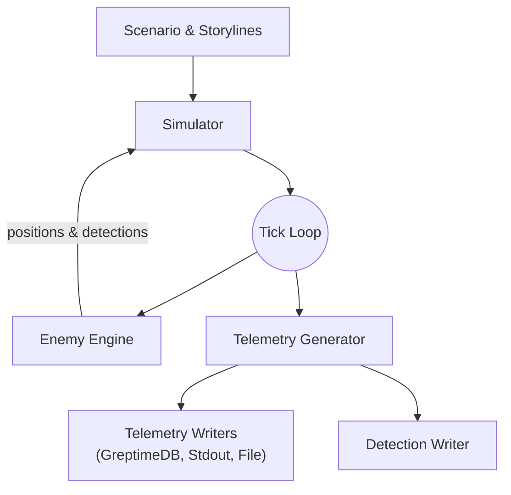

# DroneOps-Sim

> "Story-driven drone swarms that react to enemy maneuvers, chart evolving missions, and stream every dramatic turn to GreptimeDB or your console."

## Overview

**DroneOps-Sim** is a lightweight Go-based simulator that generates realistic drone telemetry for demonstration, testing, and learning purposes.

It supports:

- **Multiple drone fleets** (small FPV, medium UAV, large UAV)
- **Randomized movement patterns** (random walk)
- **Battery drain and failure simulation**
- **Configurable sensor errors, communication dropouts, and battery anomalies**
- **Output to GreptimeDB** using its gRPC ORM interface **or** to STDOUT for quick demos
- **Mission scenarios** scripted with a lightweight DSL for phases and enemy objectives
- **Observer dashboard** for stepping through mission events, switching perspectives, and injecting commands
- **Swarm-event logs** for follower assignments, reassignments, and formation changes
- **Per-tick simulation state metrics** including communication reliability, sensor noise, weather impact, and chaos-mode status
- **Interactive TUI** with hotkeys (`q` quit, `w` wrap, `s` scroll, `e` spawn enemy via `type,lat,lon,alt` + `Enter`; dialog auto-fills near the latest drone position for quick spawning, `E` edit/remove enemy via `id,status|delete`, `t` toggle summary footer, `?` help overlay)

This project was designed to support visualization dashboards (e.g., Grafana Geomap panel) and multi-cluster sync scenarios (mission clusters → command cluster).

For development and contribution guidelines, see [docs/CONTRIBUTING.md](docs/CONTRIBUTING.md).

## Purpose

- Provide a realistic demo data source for telemetry pipelines.
- Learn and practice:
  - IoT data modeling for time-series databases
  - GreptimeDB ingestion (gRPC ORM)
  - Kubernetes & Helm deployment
  - Grafana visualization integration
- Serve as a foundation for building more complex simulations (patrol routes, mission-based events).

## Configuration

Detailed configuration options are documented in [docs/configuration.md](docs/configuration.md).
See [docs/swarm-response.md](docs/swarm-response.md) for how drone swarms react to enemy detections.
Scenarios can be authored using the [Scenario DSL](docs/scenario.md) to drive mission phases and triggers.
Common narrative patterns such as escort and search-and-rescue are available as built-in [story arcs](docs/story-arcs.md).
For tips on shaping these scenarios into compelling presentations, see [docs/demo-best-practices.md](docs/demo-best-practices.md).

## Telemetry Types

The simulator emits several telemetry streams:

- **Drone Telemetry** – core position and battery data with movement metrics.
- **Enemy Detection** – reports when drones spot hostile objects.
- **Swarm Events** – follower assignments, releases, and formation changes.
- **Simulation State** – per-tick metrics such as communication reliability and sensor noise.
- **Mission Metadata** – details about active missions and objectives.

### Sample Swarm Event

```json
{
  "cluster_id": "mission-01",
  "drone_id": "alpha-1",
  "enemy_id": "enemy-42",
  "event": "follow_assigned",
  "ts": "2024-06-24T12:00:00Z"
}
```

### Sample Simulation State

```json
{
  "cluster_id": "mission-01",
  "communication_reliability": 0.97,
  "sensor_noise": 0.02,
  "weather_impact": 0.10,
  "ts": "2024-06-24T12:00:00Z"
}
```

## Schema Validation (schemas/simulation.cue)

Configuration is validated at runtime using CUE:

cue vet config/simulation.yaml schemas/simulation.cue

## Entry Point

The `droneops-sim` binary exposes subcommands:

- `simulate` – run the real-time simulator.
- `replay` – play back a previously recorded telemetry log.

Use `droneops-sim <command> --help` to see all options.

### Simulator Flags

- `--print-only` → Print telemetry JSON to STDOUT (ignores DB)
- `--config` → Path to YAML config (default: config/simulation.yaml)
- `--schema` → Path to CUE schema (default: schemas/simulation.cue)
- `--tick` → Telemetry tick interval (default: 1s)
- `--log-file` → Optional path to write telemetry and detection logs (JSONL)

### Replay Flags

- `--input` → Path to telemetry log file (required)
- `--speed` → Playback speed multiplier (default: 1.0)
- `--print-only` → Print telemetry to STDOUT instead of writing to DB

### Environment Variables

The simulator can be configured through the following environment variables:

| Variable | Default | Required | Description |
|----------|---------|----------|-------------|
| `GREPTIMEDB_ENDPOINT` | _none_ | Yes (for GreptimeDB) | GreptimeDB gRPC endpoint. If unset, telemetry is printed to STDOUT. |
| `GREPTIMEDB_TABLE` | `drone_telemetry` | No | Table for drone telemetry records. |
| `ENEMY_DETECTION_TABLE` | `enemy_detection` | No | Table storing enemy detection events. |
| `SWARM_EVENT_TABLE` | `swarm_events` | No | Table storing swarm coordination events. |
| `SIMULATION_STATE_TABLE` | `simulation_state` | No | Table storing per-tick simulation state metrics. |
| `MISSION_METADATA_TABLE` | `mission_metadata` | No | Table storing mission metadata. |
| `CLUSTER_ID` | `mission-01` | No | Cluster identity tag added to each telemetry line. |
| `TICK_INTERVAL` | `1s` | No | Telemetry tick interval (Go duration). Overrides the `--tick` flag. |
| `ENABLE_DETECTIONS` | `true` | No | Toggle emission of enemy detection stream. |
| `ENABLE_SWARM_EVENTS` | `true` | No | Toggle emission of swarm event stream. |
| `ENABLE_MOVEMENT_METRICS` | `true` | No | Toggle emission of movement telemetry. |
| `ENABLE_SIMULATION_STATE` | `true` | No | Toggle emission of simulation state stream. |

## Grafana Dashboard

Render the Grafana dashboards using environment variables and the `make dashboard` command.

```bash
export GREPTIMEDB_DATASOURCE_UID=greptime_uid
export POSTGRES_DATASOURCE_UID=postgres_uid
make dashboard
```

See [docs/grafana-dashboard.md](docs/grafana-dashboard.md) for details.

## Quickstart

See [docs/quickstart.md](docs/quickstart.md) for step-by-step instructions.

## Log Export & Playback

- Use `--log-file` to export telemetry and enemy detection events as JSONL files.
  Swarm coordination events are written to a `.swarm` companion file.
- Replay a recorded mission:

```bash
droneops-sim replay --input mission.log --print-only
```

- Control playback rate using `--speed` (e.g., `--speed 2` for 2x).

## Examples

### STDOUT output

The simulator first prints the mission metadata and then begins emitting drone
telemetry lines. Example mission record:

```json
{"id":"firewall","name":"Operation: Firewall","objective":"Defend the area from intrusions.","description":"Drones patrol the perimeter to ensure no unauthorized access.","region":{"name":"central-europe","center_lat":48.2,"center_lon":16.4,"radius_km":300}}
```

Example drone telemetry line:

```json
{"cluster_id":"mission-01","drone_id":"recon-swarm-204951-A","mission_id":"m1","lat":48.19985,"lon":16.39983,"alt":99.9,"battery":99.5,"status":"ok","follow":false,"movement_pattern":"patrol","speed_mps":12.3,"heading_deg":180,"previous_position":{"lat":48.19980,"lon":16.39980,"alt":100},"synced_from":"","synced_id":"","synced_at":"0001-01-01T00:00:00Z","ts":"2025-07-29T20:49:52.332081195Z"}
```

## Architecture

The simulator orchestrates scenario-driven missions, enemy behaviour, and telemetry output using a tick-based loop.



## Grafana Dashboard (Recommended)

- Use the GreptimeDB data source for Grafana.
- Add a Geomap panel with:
- lat, lon as coordinates
- status, battery as extra fields
- Combine with filters (cluster_id, model) and aggregate views.

## Debugging

- Print mode (--print-only) helps verify telemetry without DB access.
- Logs:
- [Simulator] → telemetry generation
- [GreptimeDBWriter] → DB ingestion results
- Validate config manually:

```bash
cue vet config/simulation.yaml schemas/simulation.cue
```

Test:

```bash
go test ./... -v
```

## Deployment in Kubernetes

For Helm deployment instructions, see [docs/helm-deployment.md](docs/helm-deployment.md).

## Mission Configuration and Visualization

### Mission Objectives

The `droneops-sim` project supports mission-based drone operations. Missions are defined in the `missions` section of `config/simulation.yaml` and include:

- **ID**: Unique identifier for the mission.
- **Name**: Catchy name matching the mission objective (e.g., "Operation: Firewall").
- **Objective**: The main goal of the mission.
- **Description**: A short story or background for the mission.
- **Region**: The target area for the mission.

Example mission configuration:

```yaml
missions:
  - id: "firewall"
    name: "Operation: Firewall"
    objective: "Defend the area from intrusions."
    description: "Drones patrol the perimeter to ensure no unauthorized access."
    region:
      name: "central-europe"
      center_lat: 48.2
      center_lon: 16.4
      radius_km: 300
```

Example fleet referencing a mission:

```yaml
fleets:
  - name: recon-swarm
    model: small-fpv
    mission_id: recon
    # ... other fleet settings ...
```

The `mission_id` field links each fleet to a mission. Once code support is in place, the simulator will use this relationship to spawn fleets for specific missions and tag all emitted telemetry accordingly.

### Integration with Telemetry

Each drone is associated with a mission via the `mission_id` field, enabling:

- **Mission Visualization**: Display mission objectives and regions in Grafana.
- **Drone Association**: Group and filter drones by mission.

### Grafana Dashboard

The Grafana dashboard integrates mission data to provide:

- **Mission Objectives**: Display the name, objective, and description.
- **Region Visualization**: Overlay mission regions on the Geomap panel.
- **Drone Telemetry**: Filter and group drones by mission.
- **Simulation State Panels**: Track communication reliability, sensor noise trends, and chaos-mode indicators over time.

### Program Logic

On startup, the program:

1. Loads mission and fleet data from `config/simulation.yaml`.
2. Inserts mission telemetry into stdout or GreptimeDB.
3. Associates fleets and their drones with missions using the `mission_id` field.

## Admin WebUI

### Features Overview

The Admin WebUI provides a centralized interface for monitoring and managing drone fleets in real-time. It is designed to be lightweight, responsive, and user-friendly.

### Features

- **Fleet Overview**: Displays detailed information about each drone fleet, including model, movement pattern, battery status, and failure rates.
- **Chaos Mode Toggle**: Allows users to enable or disable chaos mode, simulating random failures and unpredictable behavior.
- **Drone Launch Control**: Provides an interface to launch drones for specific missions or operations.
- **Mission Visualization**: Shows mission objectives, regions, and associated drones.
- **3D Map Option**: Explore an interactive CesiumJS scene with textured terrain, dynamic lighting, and mission annotations at `/3d`.
- **Interactive Command Console**: Enables direct interaction with the simulator for advanced operations.

### Access

The Admin WebUI is exposed on port `8080` and can be accessed via a web browser. Ensure the Kubernetes service is correctly configured to route traffic to the Admin WebUI.

### Deployment

The Admin WebUI is included in the Helm chart for the `droneops-sim` project. Follow the steps in the [Deployment in Kubernetes](#deployment-in-kubernetes) section to deploy the simulator and access the Admin WebUI.

## Enemy Detection

The simulator includes an enemy detection subsystem used to test how drones react to hostile objects.

- An **Enemy Simulation Engine** spawns a configurable number of enemies across all configured zones and updates them each tick. Enemies react to nearby drones with evasive maneuvers, may group together, or deploy decoys.
- Every drone checks for enemies within a configurable detection radius (default: 1&nbsp;km) each tick. Confidence is influenced by distance as well as sensor noise, terrain occlusion and weather conditions.
- Detection events are written to the table specified by `ENEMY_DETECTION_TABLE` when writing to GreptimeDB, or printed to STDOUT in print-only mode.

Each detection record captures the detecting drone's coordinates, the enemy's location, range and bearing from the drone, and an estimated enemy velocity.

See [docs/enemy-detection.md](docs/enemy-detection.md) for more details on the available settings and event format.
