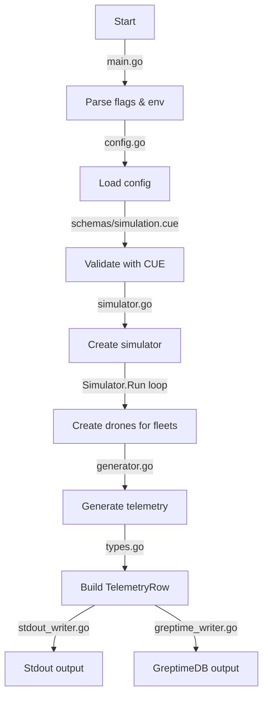

# DroneOps-Sim

## Overview

**DroneOps-Sim** is a lightweight Go-based simulator that generates realistic drone telemetry for demonstration, testing, and learning purposes.

It supports:

- **Multiple drone fleets** (small FPV, medium UAV, large UAV)
- **Randomized movement patterns** (random walk)
- **Battery drain and failure simulation**
- **Output to GreptimeDB** using its gRPC ORM interface **or** to STDOUT for quick demos

This project was designed to support visualization dashboards (e.g., Grafana Geomap panel) and multi-cluster sync scenarios (mission clusters → command cluster).

## Purpose

- Provide a realistic demo data source for telemetry pipelines.
- Learn and practice:
  - IoT data modeling for time-series databases
  - GreptimeDB ingestion (gRPC ORM)
  - Kubernetes & Helm deployment
  - Grafana visualization integration
- Serve as a foundation for building more complex simulations (patrol routes, mission-based events).

## Configuration

### Simulation Configuration (`config/simulation.yaml`)

Defines zones, missions and fleets:

```yaml
zones:
  - name: central-europe
    center_lat: 48.2
    center_lon: 16.4
    radius_km: 300
missions:
  - name: surveillance-alpha
    zone: central-europe
    description: Recon and patrol of key areas
  - name: cargo-beta
    zone: central-europe
    description: Deliver supplies between bases
fleets:
  - name: recon-swarm
    model: small-fpv
    count: 20
    movement_pattern: patrol
    home_region: central-europe
    behavior:
      battery_drain_rate: 0.5
      failure_rate: 0.02
      speed_min_kmh: 50
      speed_max_kmh: 90
```

## Schema Validation (schemas/simulation.cue)

Configuration is validated at runtime using CUE:

cue vet config/simulation.yaml schemas/simulation.cue

## Entry Point

### CLI Flags

- `--print-only` → Print telemetry JSON to STDOUT (ignores DB)
 - `--config` → Path to YAML config (default: config/simulation.yaml)
 - `--schema` → Path to CUE schema (default: schemas/simulation.cue)

### Environment Variables

- `GREPTIMEDB_ENDPOINT` → If set, telemetry is written to this GreptimeDB endpoint
- `GREPTIMEDB_TABLE` → Target table for telemetry (default: drone_telemetry)
- `MISSION_METADATA_TABLE` → Table storing mission metadata (default: mission_metadata)
- `CLUSTER_ID` → Cluster identity tag (default: mission-01)

## Quickstart

### Local Demo (Print Only)

```bash
make build
make run
```

### Write to GreptimeDB

```bash
export GREPTIMEDB_ENDPOINT=127.0.0.1:4001
export GREPTIMEDB_TABLE=drone_telemetry
./build/droneops-sim
```

Docker run:

```bash
docker build -t droneops-sim:latest .
docker run --rm \
    -e GREPTIMEDB_ENDPOINT=127.0.0.1:4001 \
    -e GREPTIMEDB_TABLE=drone_telemetry \
    droneops-sim:latest
```

## Examples

### STDOUT output

```json
{"cluster_id":"mission-01","drone_id":"recon-swarm-123456-A","lat":48.2023,"lon":16.4098,"alt":100.5,"battery":99.5,"status":"ok","synced_to_json":"[]","ts":"2025-07-23T12:34:56Z"}
```

## Data Flow



## Grafana Dashboard (Recommended)

- Use the GreptimeDB data source for Grafana.
- Add a Geomap panel with:
- lat, lon as coordinates
- status, battery as extra fields
- Combine with filters (cluster_id, model) and aggregate views.

## Debugging

- Print mode (--print-only) helps verify telemetry without DB access.
- Logs:
- [Simulator] → telemetry generation
- [GreptimeDBWriter] → DB ingestion results
- Validate config manually:

```bash
cue vet config/simulation.yaml schemas/simulation.cue
```

Test:

```bash
go test ./... -v
```

## Deployment in Kubernetes

### Using the Helm Chart

The `droneops-sim` project includes a Helm chart for deploying the simulator in Kubernetes. Follow these steps to deploy:

1. **Install Helm**:
   Ensure Helm is installed on your system. Refer to the [Helm installation guide](https://helm.sh/docs/intro/install/) if needed.

2. **Navigate to the Helm chart directory**:

   ```bash
   cd helm/droneops-sim
   ```

3. **Customize values**:

   Edit the `values.yaml` file to configure replicas, image, service type, resources, and simulation configuration.

4. **Deploy the chart**:

   Run the following command to deploy:

   ```bash
   helm install droneops-sim .
   ```

   This will deploy the simulator with the default configuration.

5. **Verify deployment**:

   Check the status of the deployment:

   ```bash
   kubectl get all -l app=droneops-sim
   ```

6. **Access the service**:

   The simulator exposes a metrics endpoint. Use the following command to get the service details:

   ```bash
   kubectl get svc droneops-sim
   ```

### Notes

 - The Helm chart uses ConfigMaps to manage simulation and schema configurations.
- Ensure the Kubernetes cluster has sufficient resources to handle the configured replicas and resource limits.
- Update the `GREPTIMEDB_ENDPOINT` and `GREPTIMEDB_TABLE` environment variables in the deployment if connecting to a real database.

For more details, refer to the `helm/droneops-sim` directory and the `values.yaml` file.
