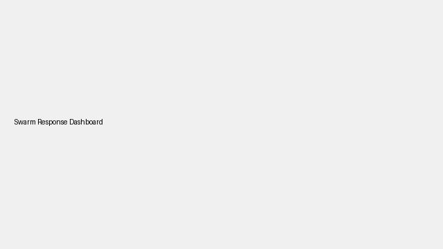

# Swarm Response Behaviour

This feature controls how many drones break formation to follow a detected enemy. The response begins with a base mapping per movement pattern but can increase depending on the threat level.

| Movement Pattern | Base Behaviour | Purpose |
|------------------|----------------|---------|
| **patrol** | One additional drone is dispatched to follow the enemy while the rest continue patrolling. | Keeps patrol coverage while still tracking potential threats. |
| **point-to-point** | The detecting drone itself deviates from its route to pursue the target. | Maintains delivery or transport integrity without pulling extra units. |
| **loiter** | Two drones converge on the enemy position. | Provides focused attention in loiter scenarios where rapid response is desired. |

The simulator adjusts the follower count when:

* **Detection confidence** exceeds 90% – one more drone joins the chase.
* **Enemy type** is `vehicle` or `drone` – another drone is allocated.
* **Mission criticality** (`low`, `medium`, `high`) adds 0, 1 or 2 additional followers respectively.

Configure the base mapping under `swarm_responses` and the mission importance with `mission_criticality` in `config/simulation.yaml`.

### Example Configuration

```yaml
swarm_responses:
  patrol: 1
  point-to-point: 0
  loiter: 2
mission_criticality: high
```

## Predictive Interception

When several drones pursue a moving enemy, they no longer trail the target. Instead, the simulator predicts the enemy's path and assigns intercept and flanking points so the swarm can cut off escape routes cooperatively.

## Formation Reconfiguration

When drones peel off to pursue a target, the remaining units automatically reposition around the home region. This reconfiguration keeps surveillance coverage balanced by assigning new patrol points to the drones still in formation.

## Swarm Event Telemetry

Follower assignments, releases, and formation adjustments generate `swarm_event` records. Each event captures the affected drone IDs, related enemy, and a timestamp. These rows can be stored in GreptimeDB or written to JSONL logs for downstream analysis.

## Communication Constraints and Failover

Swarms operate over lossy channels. The simulator can drop follow commands or telemetry updates based on a `communication_loss` probability and limits the number of commands per tick with `bandwidth_limit`. When a follower drops out or fails, the remaining drones reach consensus by selecting the highest-battery idle unit to take over tracking so priorities remain aligned despite signal issues.



